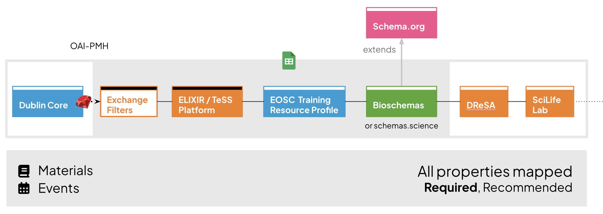

# TeSSHub metadata model
Minimum metadata model and all-to-all exchange for the TeSS Platform, suitable for federation with EOSC.

This model is the output from a series of online workshops where we define the metadata model used in the TeSS Platform for exchange with other training registries in any domain. We started with the mapping work from the mTeSS-X focus group then refined the outputs over events in February, March and May 2026. The goal was to reach a consensus of a minimum metadata model for exchange (all-against-all) that is appropriate for the federation of learning materials across EOSC. 

## Introduction

The [**mTeSS-X** (Multi-tenanting TeSS eXchange) project](https://elixirtess.github.io/mTeSS-X/) builds upon the **ELIXIR TeSS platform** to address the fragmentation of training resources across Research Infrastructures (RIs) and scientific domains. Through the implementation of **multi-tenancy**, we can share training resources between disciplines while maintaining unique training catalogues within a single shared instance. Additionally, the TeSS-X plugins will be introduced to enable seamless content **exchange** between catalogues hosted as separate instances. 

The work continues through [TeSSHub4EOSC](https://eosc.eu/horizon-europe-projects/tesshub4eosc), an EOSC Gravity inter-project, which will establish a distributed, FAIR-compliant catalogue infrastructure for training materials and events within the European Open Science Cloud (EOSC). The primary outcome will be a central TeSSHub instance complementing discipline-specific catalogs like ELIXIR TeSS and PaN- Training. This instance will allow EOSC nodes, communities, science clusters, and competence centers to create custom-branded views or spaces with their own content, without maintaining separate infrastructure. The solution will also support the EOSC Academy, fostering scalable and sustainable access to training materials across EOSC.

## Features

* The work has a foundation in the TeSS Platform, founded in ELIXIR (European RI for life sciences) in 2016. Materials and events are serialised from TeSS according to [Bioschemas](https://bioschemas.org/), a specialised set of profiles building on [Schema.org](http://Schema.org).   
* Instances of the TeSS Platform are deployed and customised in multiple domains, especially PaNOSC (photon and neutron training) and EVERSE (research software quality), both of whom collaborate with ELIXIR through the mTeSS-X OSCARS project. Features are added from these and other communities, including additions to the TeSS data model.   
* This proposed updated minimum metadata model builds on work from [RDA (2022)](https://doi.org/10.15497/RDA00073), [Skills4EOSC (2025)](https://www.skills4eosc.eu/resources/quality-assurance-certification-framework), Flemish RDM, ELIXIR BioHackathon Europe, de.NBI BioHackathon Germany, NFDI, DALIA, EOSC Training WG, mTeSS-X, ELIXIR TeSS Club.  
* It is a collection of properties and suggested vocabularies that are the minimum required for FAIR training material and event discovery and exchange. It considers materials being automatically ingested into a TeSSHub instance, either from the web or directly from another TeSSHub instance.  
* This work considers materials and events side-by-side (a material is considered an event if it has a date and location). Previous work has focused on materials, not events.  
* We add properties as advised by the mTeSS-X focus group and EOSC training and competencies working group, appropriate for the federation of materials across EOSC. 

## Files

- `images/`
  - `all-to-all-diagram.png`: Graphical representation of the mapping
- `models/`
  - `all-to-all-mapping.csv`: All-to-all mapping, CSV format
  - `all-to-all-mapping.xlsx`: All-to-all mapping, Excel format
  - `minimum-metadata-model.csv`: Excerpt with required and recommended properties for TeSSHub, CSV format
  - `minimum-metadata-model.xlsx`: Excerpt with required and recommended properties for TeSSHub, Excel format
- `LICENSE`: Creative Commons Zero 1.0 license
- `README.md`: This document

## Minimum metadata model

An excerpt of the all-to-all mapping is provided with the required and recommended properties for TeSSHub. The following properties are described as one of:

- Required
- Required if exists*
- Recommended
- Optional 

Most of the optional properties are omitted in the minimum model for clarity. They are described in the all-to-all mapping. *Some properties are only required if they exist; these may be implemented similar to Recommended properties.

### Describing the minimum model

- Minimum metadata model 2026 Material
- Minimum metadata model 2026 Event
- MMM 2026 Expected Schemaorg Type
- MMM 2026 Cardinality
- MMM 2026 Values / CV
- MMM 2026 Material Required
- MMM 2026 Event Required
- RDA Description
- TeSS Description
- Example 1 (Material)
- Example 2 (Event)

## All-to-all mapping

The columns in the full model are grouped as follows:

### Ingestion / core TeSS

- Dublin Core
- Can filter at TeSS exchange
- Filter comment
- TeSS Material property
- TeSS Event property
- Property comment
- DC ingestion comment

### EOSC Training Resource Profile 2024

- EOSC Training Property 2024
- EOSC comment

### TeSSHub Minimum metadata model
- Minimum metadata model 2026 Material
- Minimum metadata model 2026 Event
- MMM 2026 Expected Schemaorg Type
- MMM 2026 Cardinality
- MMM 2026 Values / CV
- MMM 2026 Material Required
- MMM 2026 Event Required

### Bioschemas serialization 
- Bioschemas property in TrainingMaterial
- Bioschemas property in CourseInstance
- Bioschemas serialised by TeSS
- Bioschemas subproperties
- Bioschemas notes

### DReSA
- DReSA Material property
- DReSA Event property
- DReSA comment

### SciLifeLab
- SciLifeLab Material property
- SciLifeLab Event property
- SciLifeLab comment

### RDA Learing Resource 2021
- RDA Learning Resource Minimum 2021
- RDA Description

## Next steps

A technical requirements document has been provided to the TeSSHub development team to implement the properties are new or modified for this model. This work will be conducted as part of the mTeSS-X and TeSSHub4EOSC projects, under the broader TeSS Platform governance.

A proposal will be made to the Bioschemas Training Group to adopt the recommended changes to the `TrainingMaterial` and `CourseInstance` profiles in future versions. 

## Acknowledgements
- [mTeSS-X](https://elixirtess.github.io/mTeSS-X/): Scaling training portal federation for RIs through Multi-tenanting and Exchange ([OSCARS](https://www.oscars-project.eu/projects/mtess-x-scaling-training-portal-federation-ris-through-multi-tenanting-and-exchange))
- [TeSSHub4EOSC](https://elixirtess.github.io/mTeSS-X/tesshub4eosc): training registry for EOSC nodes and science clusters ([EOSC Gravity](https://eosc.eu/horizon-europe-projects/tesshub4eosc))
- ELIXIR Europe
- PaNOSC
- SciLifeLab
- DReSA
- Flemish RDM 
- Bioschemas
- RDA
- EOSC Training and Competencies Working Group
- OpenAIRE Training Community of Practice
- The University of Manchester
- Helmholtz Zentrum Dresden Rossendorf (HZDR)
- CERN
- University of Limerick
- University of Tartu
